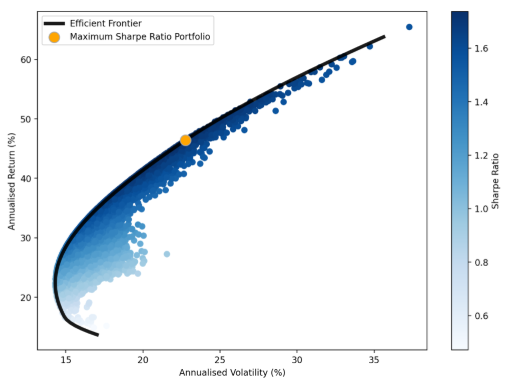

# Portfolio Optimization Dashboard

This project is a Stock Portfolio Optimization Calculator that leverages multiple optimization techniques to enhance portfolio performance. It features interactive graphical visualizations of the efficient frontier and key portfolio metrics. The application is web-hosted, utilizing Streamlit for an intuitive and user-friendly interface.

The project can be found here: [Link to Project]("https://portfolio-optimization.streamlit.app/")

## Optimization Strategies

**Sharpe Ratio**: Measures the return generated for each unit of total risk taken, helping investors evaluate risk-adjusted performance.

**Volatility**: Measures the degree of fluctuation in portfolio returns, represented by the standard deviation, and is crucial for understanding the overall risk level.    

**Sortino Ratio**: Measures the return generated for each unit of downside risk, focusing on negative volatility to assess risk-adjusted performance in a more targeted way.

**Tracking Error**: Measures the degree to which a portfolio's returns deviate from its benchmark, indicating how closely the portfolio follows the benchmark's performance.

**Information Ratio**: Evaluates the additional return achieved beyond a benchmark for every unit of active risk, offering a measure of how effectively the portfolio is being actively managed.

**Conditional Value-at-Risk (CVaR)**: Measures the expected loss in extreme market conditions, focusing on worst-case scenarios to help assess potential downside risk.

## Assumptions
**Historical Returns as Predictors**: The model assumes that past returns indicate future performance, using historical data to estimate expected returns based on observed patterns.

**Normal Distribution of Returns**: It assumes that asset returns follow a normal distribution, simplifying risk and return calculations but potentially overlooking extreme events.

**No Transaction Costs**: The model assumes there are no transaction costs or taxes related to buying, selling, or rebalancing assets, which may lead to less realistic outcomes.

**Full Investment**: It assumes that all available capital is fully invested, with no cash reserves, eliminating considerations of cash drag or liquidity.

**Fixed Time Horizon**: The model operates on a fixed investment period, assuming that the investor’s objectives and risk tolerance remain constant, regardless of market changes.

## Features

**Interactive Visualisations**: Graphs and charts that visualize the efficient frontier, allowing the user to assess various portfolio scenarios and understand key metrics intuitively.

**Risk Management**: Dedicated tools to evaluate and manage risk, helping the user make informed decisions based on their risk tolerance and investment strategy.

**Statistical Metrics**: A comprehensive suite of statistical measures, including skewness and kurtosis to gain deeper insights into portfolio performance and returns.

**Benchmark Comparison**: Visualisation of portfolio returns against the benchmark index, providing the user a clear understanding of their investment's relative performance and effectiveness.

## Efficient frontier
The Efficient Frontier is visualized as a curve representing the optimal set of investment portfolios that offer the highest expected return for a given level of risk, created using 10,000 simulations of portfolios with varying asset weights. Each point along the frontier illustrates the trade-off between risk (volatility) and return, enabling users to identify the most efficient portfolios. Portfolios lying on this curve are considered optimal, while those below the frontier indicate suboptimal returns for their associated risk levels, allowing investors to make informed decisions based on their individual risk tolerance and investment goals.
{ width=50% }

## Usage

1. Open the application in your web browser: https://portfolio-optimization.streamlit.app/
2. Enter your tickers, start and end dates, and risk-free rate in the input fields.
3. Select an optimization strategy from the dropdown menu.
4. Click the "Calculate" button to generate your optimized portfolio.
5. Explore the various tabs to view performance metrics, visualizations, and risk analysis for your portfolio.

## Contributing

Contributions are welcome! If you'd like to contribute to this project, please fork the repository and submit a pull request with your changes.

